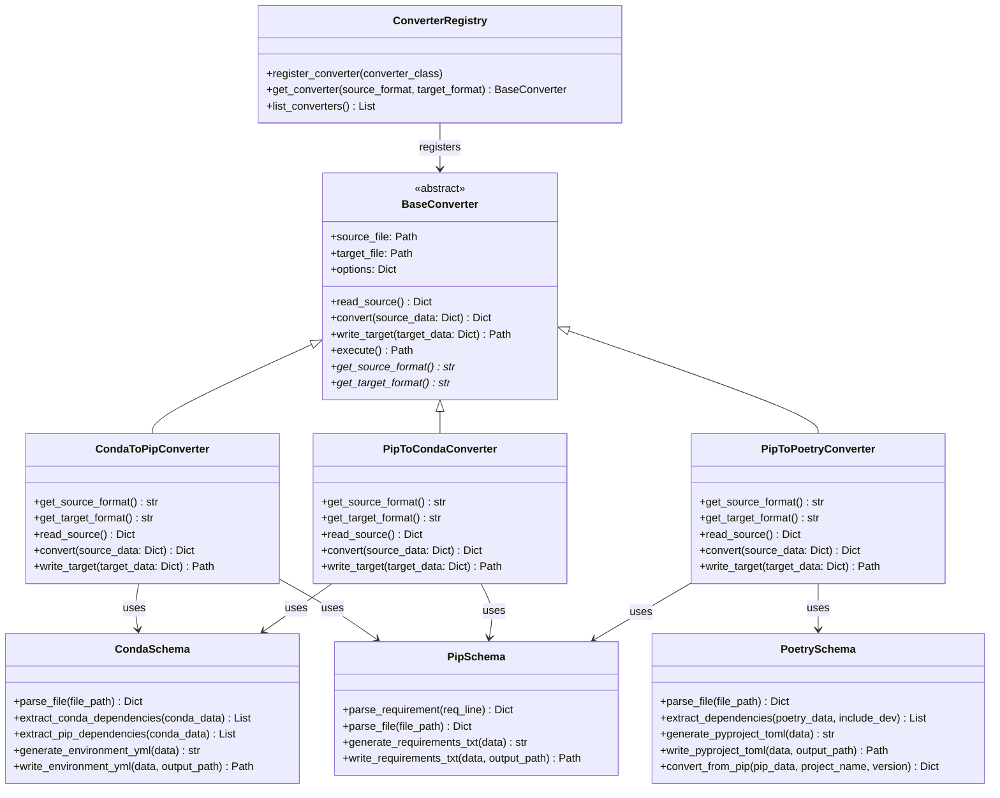

# Spectomate Architecture Diagram

The following diagram shows the architecture of the Spectomate system, displaying the main components and their relationships.

The diagram shows the class hierarchy and relationships between them. `BaseConverter` is an abstract class from which all converters inherit. Each converter uses appropriate data schemas to parse and generate files in different formats. `ConverterRegistry` manages the registration and access to converters.
