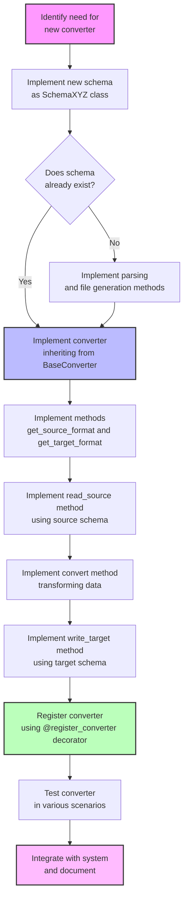

# Spectomate System Extension Diagram

The following diagram shows the process of extending the Spectomate system with new converters and formats.

The diagram shows the process of extending the Spectomate system with new converters and formats:

1. Identify the need for a new converter (e.g., conversion from format X to format Y)
2. Check if schemas for formats X and Y already exist
3. If not, implement new schemas with methods for parsing and generating files
4. Implement a new converter inheriting from the BaseConverter class
5. Implement required abstract methods
6. Register the converter in the system using the @register_converter decorator
7. Test and document the new converter
