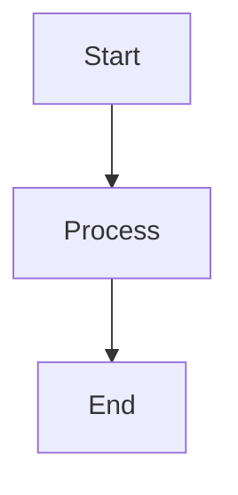

# Mermaid Diagrams in Spectomate

## Introduction

This directory contains Mermaid diagrams that illustrate the architecture and operation of the Spectomate system. The diagrams are stored in Markdown format with Mermaid code blocks that are automatically rendered by GitHub.

## Rendering Diagrams

### GitHub

GitHub automatically renders Mermaid code blocks in Markdown files. Simply open the Markdown file in the GitHub browser, and the diagrams will be rendered.

### Local Rendering

To render diagrams locally, you can use one of the following methods:

#### 1. Code Editor Extensions

- **Visual Studio Code**: Install the "Markdown Preview Mermaid Support" extension
- **JetBrains IDEs**: Built-in support for Mermaid in Markdown preview
- **Atom**: Install the "markdown-preview-enhanced" package

#### 2. Online Tools

- [Mermaid Live Editor](https://mermaid.live/) - online editor with live preview
- [Mermaid.ink](https://mermaid.ink/) - service for rendering Mermaid diagrams as images

#### 3. Generating Images from Command Line

You can install the `mermaid-cli` tool and use it to generate images:

```bash
# Install mermaid-cli
npm install -g @mermaid-js/mermaid-cli

# Generate PNG image
mmdc -i diagram.md -o diagram.png
```

## Conversion to HTML

To render Mermaid diagrams in HTML documentation, add the Mermaid script to the HTML page:

```html
<!DOCTYPE html>
<html>
<head>
    <meta charset="utf-8">
    <title>Spectomate Documentation</title>
    <script src="https://cdn.jsdelivr.net/npm/mermaid/dist/mermaid.min.js"></script>
    <script>
        mermaid.initialize({
            startOnLoad: true,
            theme: 'default'
        });
    </script>
</head>
<body>
    <div class="mermaid">
        <!-- Insert Mermaid diagram code here -->
        flowchart TD
            A[Start] --> B[End]
    </div>
</body>
</html>
```

## Converting Markdown to HTML

To convert Markdown files with Mermaid diagrams to HTML, you can use the `markdown-it` tool with the `markdown-it-mermaid` plugin:

```bash
# Install tools
npm install -g markdown-it markdown-it-mermaid

# Convert Markdown to HTML
markdown-it --mermaid diagram.md > diagram.html
```

## Adding New Diagrams

To add a new diagram:

1. Create a new Markdown file in the `docs/diagrams/` directory
2. Add a Mermaid code block surrounded by ` ```mermaid ` and ` ``` ` tags
3. Add a reference to the new diagram in the README.md file

## Example

```markdown
# Example Diagram


```

The above code will be rendered as a flow diagram from Start, through Process, to End.
