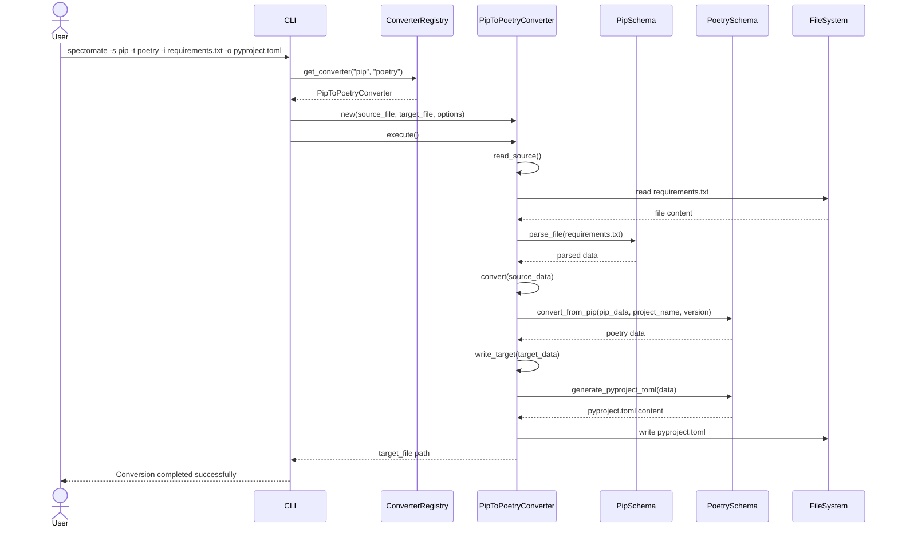

# Conversion Process Sequence Diagram in Spectomate

The following sequence diagram shows the interactions between system components during the conversion process from pip format to poetry format.

The diagram shows the sequence of interactions between system components during the conversion from pip format to poetry format:

1. The user invokes the CLI command
2. The CLI retrieves the appropriate converter from the registry
3. The converter reads the source file and parses it using the pip schema
4. The converter transforms the data from pip format to poetry format
5. The converter generates the pyproject.toml file content and writes it to the target file
6. The CLI informs the user about the completion of the conversion
