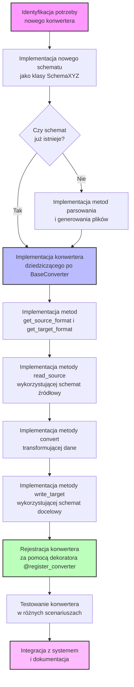

# Diagram Rozszerzania Systemu Spectomate

Poniższy diagram przedstawia proces rozszerzania systemu Spectomate o nowe konwertery i formaty.

Diagram przedstawia proces rozszerzania systemu Spectomate o nowe konwertery i formaty:

1. Identyfikacja potrzeby nowego konwertera (np. konwersja z formatu X do formatu Y)
2. Sprawdzenie, czy schematy dla formatów X i Y już istnieją
3. Jeśli nie, implementacja nowych schematów z metodami do parsowania i generowania plików
4. Implementacja nowego konwertera dziedziczącego po klasie BaseConverter
5. Implementacja wymaganych metod abstrakcyjnych
6. Rejestracja konwertera w systemie za pomocą dekoratora @register_converter
7. Testowanie i dokumentacja nowego konwertera
