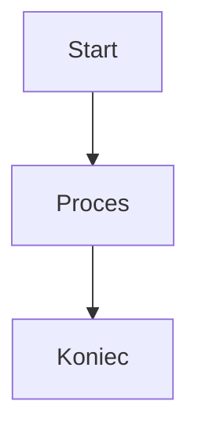

# Diagramy Mermaid w Spectomate

## Wprowadzenie

Ten katalog zawiera diagramy Mermaid, które ilustrują architekturę i działanie systemu Spectomate. Diagramy są zapisane w formacie Markdown z blokami kodu Mermaid, które są automatycznie renderowane przez GitHub.

## Renderowanie diagramów

### GitHub

GitHub automatycznie renderuje bloki kodu Mermaid w plikach Markdown. Wystarczy otworzyć plik Markdown w przeglądarce GitHub, a diagramy zostaną wyrenderowane.

### Lokalne renderowanie

Aby wyrenderować diagramy lokalnie, można użyć jednej z poniższych metod:

#### 1. Rozszerzenia do edytorów kodu

- **Visual Studio Code**: Zainstaluj rozszerzenie "Markdown Preview Mermaid Support"
- **JetBrains IDEs**: Wbudowane wsparcie dla Mermaid w podglądzie Markdown
- **Atom**: Zainstaluj pakiet "markdown-preview-enhanced"

#### 2. Narzędzia online

- [Mermaid Live Editor](https://mermaid.live/) - edytor online z podglądem na żywo
- [Mermaid.ink](https://mermaid.ink/) - serwis do renderowania diagramów Mermaid jako obrazów

#### 3. Generowanie obrazów z linii poleceń

Możesz zainstalować narzędzie `mermaid-cli` i użyć go do generowania obrazów:

```bash
# Instalacja mermaid-cli
npm install -g @mermaid-js/mermaid-cli

# Generowanie obrazu PNG
mmdc -i diagram.md -o diagram.png
```

## Konwersja do HTML

Aby wyrenderować diagramy Mermaid w dokumentacji HTML, należy dodać skrypt Mermaid do strony HTML:

```html
<!DOCTYPE html>
<html>
<head>
    <meta charset="utf-8">
    <title>Spectomate Documentation</title>
    <script src="https://cdn.jsdelivr.net/npm/mermaid/dist/mermaid.min.js"></script>
    <script>
        mermaid.initialize({
            startOnLoad: true,
            theme: 'default'
        });
    </script>
</head>
<body>
    <div class="mermaid">
        <!-- Tutaj wstaw kod diagramu Mermaid -->
        flowchart TD
            A[Start] --> B[Koniec]
    </div>
</body>
</html>
```

## Konwersja Markdown do HTML

Aby skonwertować pliki Markdown z diagramami Mermaid do HTML, można użyć narzędzia `markdown-it` z wtyczką `markdown-it-mermaid`:

```bash
# Instalacja narzędzi
npm install -g markdown-it markdown-it-mermaid

# Konwersja Markdown do HTML
markdown-it --mermaid diagram.md > diagram.html
```

## Dodawanie nowych diagramów

Aby dodać nowy diagram:

1. Utwórz nowy plik Markdown w katalogu `docs/diagrams/`
2. Dodaj blok kodu Mermaid otoczony znacznikami ` ```mermaid ` i ` ``` `
3. Dodaj odnośnik do nowego diagramu w pliku README.md

## Przykład

```markdown
# Przykładowy diagram


```

Powyższy kod zostanie wyrenderowany jako diagram przepływu od Start, przez Proces, do Koniec.
