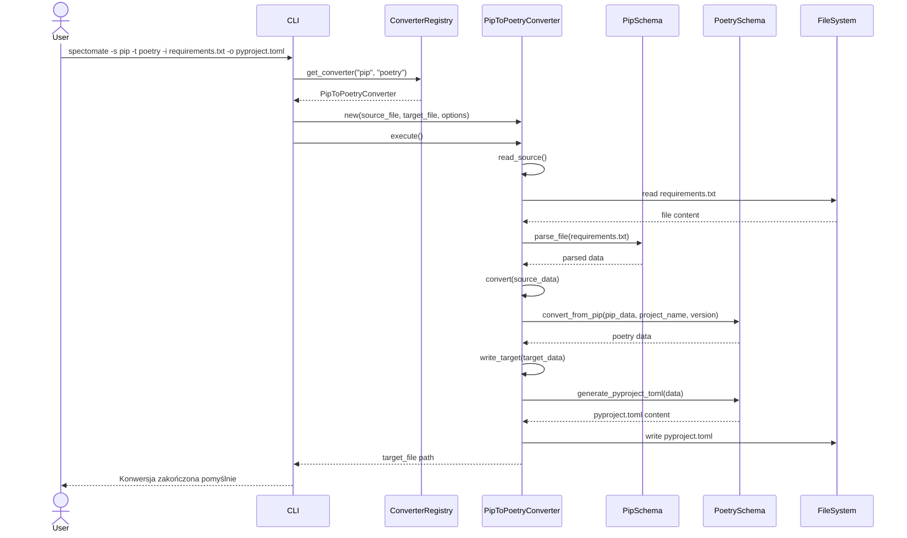

# Diagram Sekwencji Procesu Konwersji w Spectomate

Poniższy diagram sekwencji pokazuje interakcje między komponentami systemu podczas procesu konwersji z formatu pip do formatu poetry.

Diagram pokazuje sekwencję interakcji między komponentami systemu podczas konwersji z formatu pip do formatu poetry:

1. Użytkownik wywołuje polecenie CLI
2. CLI pobiera odpowiedni konwerter z rejestru
3. Konwerter odczytuje plik źródłowy i parsuje go za pomocą schematu pip
4. Konwerter konwertuje dane z formatu pip na format poetry
5. Konwerter generuje zawartość pliku pyproject.toml i zapisuje ją do pliku docelowego
6. CLI informuje użytkownika o zakończeniu konwersji
